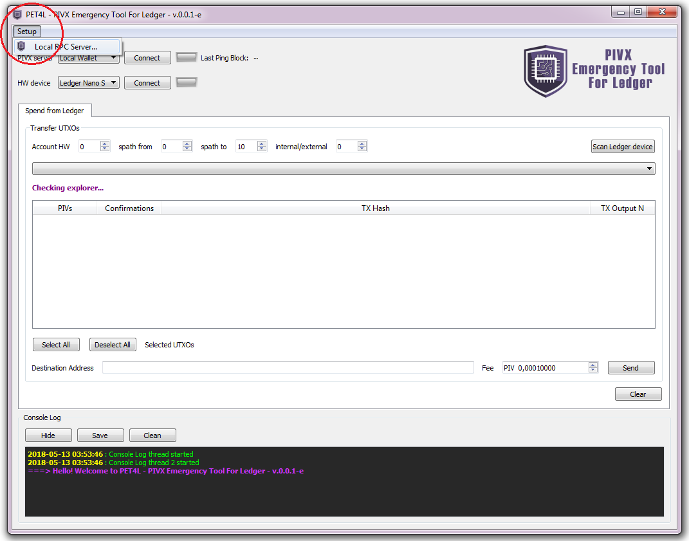
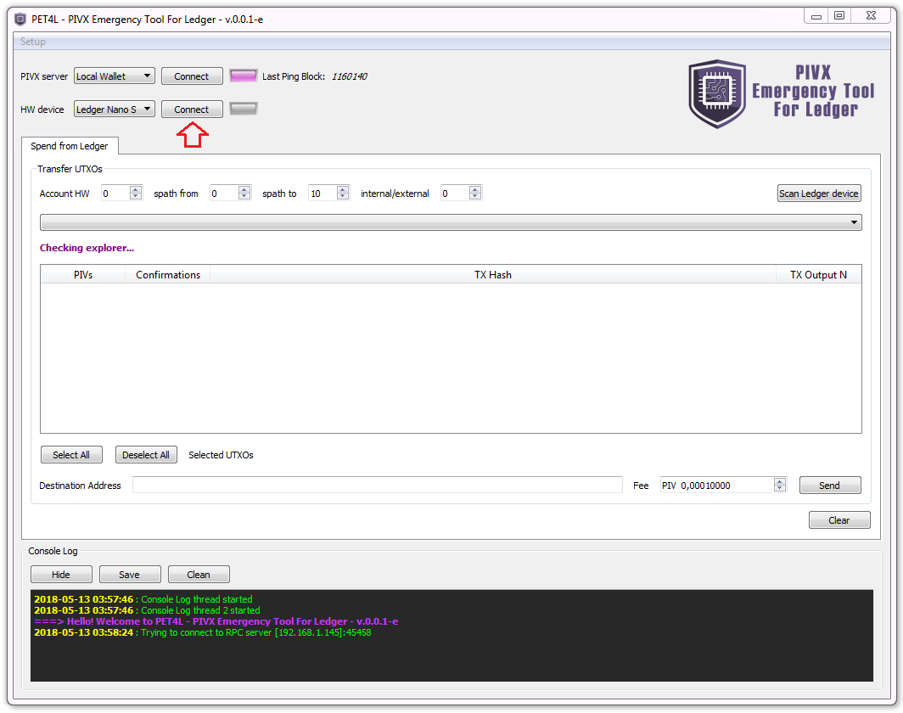
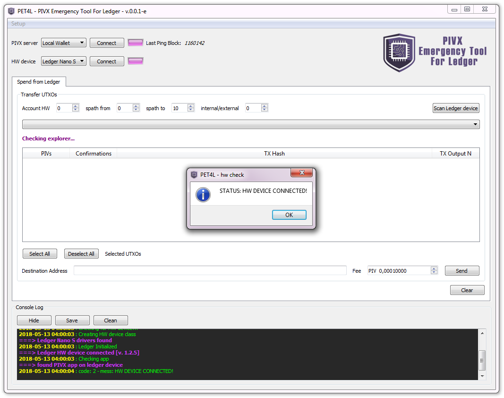
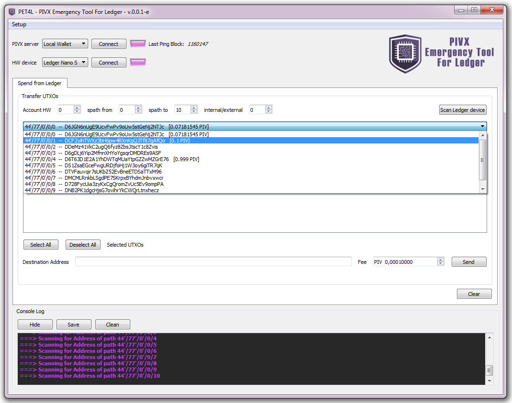
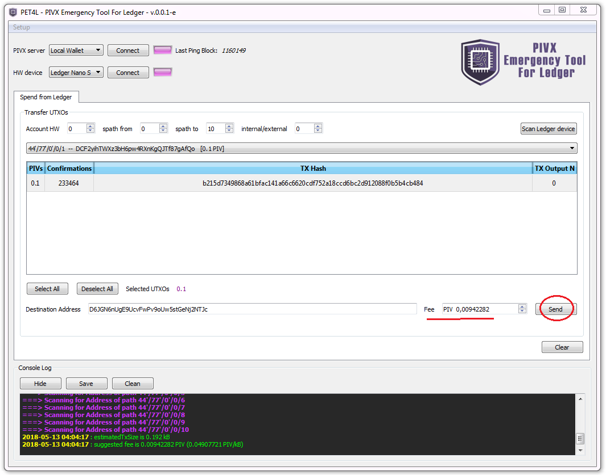
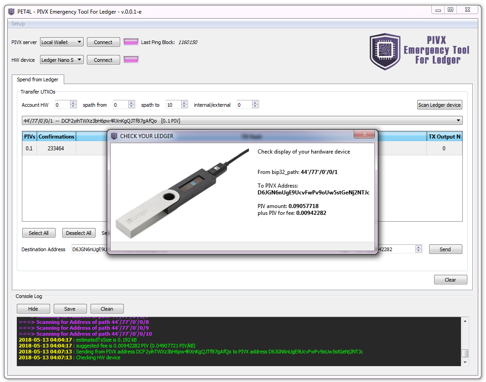
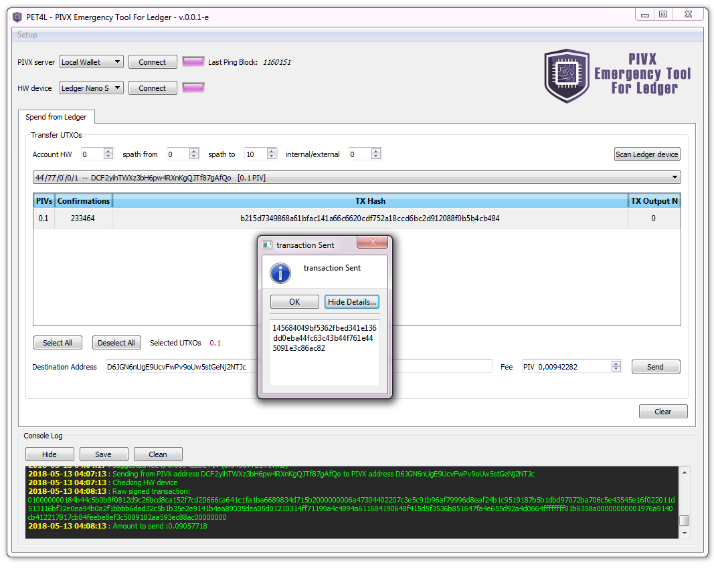
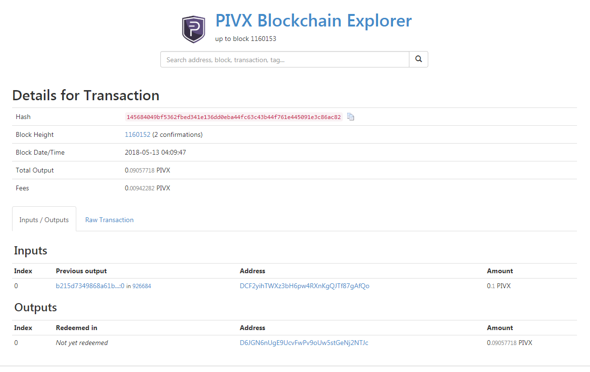

# PET4L
PET4L [PIVX Emergency Tool For Ledger] is a tool to spend PIVs that are "trapped inside" the Ledger Nano S when Ledger Wallet Chrome App acts crazy.

How does it work?

1) it fetches addresses from the device
2) asks to the block explorer the UTXOs related to each address
3) it creates the raw TX and signs the new inputs on the Nano S device
4) finally uses the `sendrawtransaction` RPC call of the Core wallet to broadcast the TX.


<b>NOTE:</b> In the current implementation, utxo data is pulled from the BE (https://chainz.cryptoid.info/pivx/). Check that this block explorer is online and properly works before using the tool.

## Installation
This application does not require installation.<br>
If you are using a [binary version](https://github.com/PIVX-Project/PET4L/releases), just unzip the folder anywhere you like and use the executable to start the application:
- *Linux*: double-click `pet4l` file inside the `app` directory
- *Windows*: double-click `pet4l.exe` file inside the `app` directory
- *Mac OsX*: double-click `pet4l.app` application folder

If you are running PET4L from the source-code instead, you will need Python3 and several libraries installed.<br>
Needed libraries are listed in `requirements.txt`.<br>
From the `PET4L` directory, launch the tool with:
```bash
python3 pet4l.py
```
To make binary versions from source, [PyInstaller](http://www.pyinstaller.org/) can be used with the `specPet4l.spec` file provided.


## Setup
#### Setting up the RPC server
In order to interact with the PIVX blockchain, PET4L needs a local PIVX wallet running alongside (any empty pivx-cli wallet will do).
Edit your local `pivx.conf` inserting rpcuser, rpcpassword, rpcport and rpcallowip.
Example:
```bash
server=1
rpcuser=myUsername
rpcpassword=myPassword
rpcport=45458
rpcallowip=127.0.0.1
```

Configure the RPC server by clicking on the menu
<br><br>

and inserting the same data.
You can leave ip `127.0.0.1` if the wallet is on the same machine as the pet4l.<br>
Otherwise set the IP address of the machine running the Core PIVX wallet.
<br><br>

#### Connections
If the IP and the credentials of the PIVX wallet are correct, it should connect with pet4l instantly.<br>
Otherwise use the `Connect` button next to "PIVX server: Local Wallet".<br>
Connect the hardware device to USB and open the PIVX-App on it.<br>
Click the button `Connect` next to "HW device: Ledger Nano S" to connect to the hardware device.
<br><br>

Once successfully connected, it gives a confirmation message and the led turns purple.
<br><br>

## Usage
#### Loading Addresses And UTXOs
Adjust the fields as needed:
- <b>Account HW</b> : insert the account number you wish to recover funds from (default: 0)
- <b>spath from</b> : insert the n. of the first address to search (default: 0)
- <b>spath to</b> : insert the n. of the last address to search (default: 10)
- <b>internal/external</b> : insert 0 for normal addresses and 1 for change addresses (default: 0)


Click on `Scan Ledger Device` to retrieve the addresses and load the UTXOs
<br><br>
<br>
Open the menu to select an address and check related UTXOs
<br><br>

#### Spending UTXOs
Once loaded, select those UTXOs you wish to spend.<br>
Insert the destination address.<br>
Check the suggested fee and adjust as preferred.<br>
Then click on `Send`
<br><br>
<br>
Verify the details of the TX both on screen and on the display of the Nano S.
If everything checks out, click "yes" (right button) on the device.
<br><br>
<br>
The transaction is now assembled and signed.<br>
Pet4l asks one more time to check the details before broadcasting the transaction (thus spending the selected UTXOs).
<br><br>
<br>
Click `Yes` to finally broadcast the transaction to the PIVX network.
<br>
Click `Show Details` to get the TX-id that identify the transaction.
<br><br>
<br>
It should appear on the Block Explorers after a few minutes.
<br><br>
